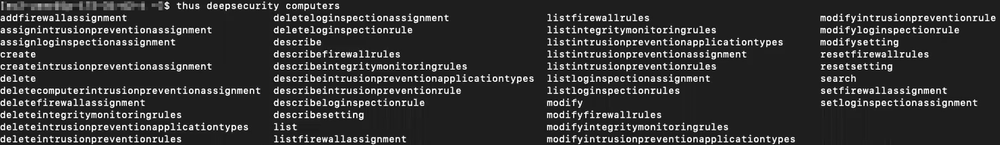

# Trend Micro Hybrid Cloud Security Command Line Interface (thus)

The Deep Security API enables you to automate operational tasks, thereby increasing the productivity of your value streams and improving the security services that you support. Trend Micro Hybrid Cloud Security Command Line Interface is a consistent interface that provides support for automating your tasks using the Deep Security API. This tool is particularly useful to leverage the Deep Security API without the need for a deep dive into Python or APIs.
All replies from the server are in JSON. Therefore [jq](https://stedolan.github.io/jq/) is a good companion program to pipe the output to. For most distributions, you can install jq with `yum install jq` or `apt-get install jq`.

### Install the Trend Micro Hybrid Cloud Security Command Line Interface

1.	Ensure you have Python 3.6.x or greater installed
2.	In the terminal of your choice, enter the following command: 
3.	To install for your user: `pip3 install --user tm-thus`
4.	To install globally: `sudo pip3 install tm-thus`
5.	If you're using a virtual environment, set that up first then enter: `pip3 install tm-thus`

## Enable command completion

The Trend Micro Hybrid Cloud Security Command Line Interface package includes a very useful command completion feature.
To enable tab completion under bash, enter the following depending on how you installed thus:

If you installed with `--user` run:
`source ~/.local/bin/thus_completer_bash.sh`

If you installed thus globally run:
`source /usr/bin/thus_comleter_bash.sh`

To enable this on every login, add the command to your `~/.bashrc` file. 

## Integrate

Before using the CLI tool, you need to provide the credentials and hostnames of your service.
1.	Create a credentials file: ~/.thus/credentials.
2.	Enter the following in the file:

    [default]
    DSMapikey =

For DSMapikey, create an API key in the Deep Security Manager by going to Administration > User Management > API Keys > New. Fill in the necessary fields and copy the API key to your clipboard, then paste it next to DSMapikey. For example:

    [default]
    DSMapikey = E5D08256-1998-21F4-D38B-685ABF6B7CDB:523C4B26-7BD5-D537-9495-1AB2373305DA:OKdUZZIM1ZBVXS

3.	Save and close the credentials file.
4.	Create a configuration file: ~/.thus/config.
5.	Enter the following in the file:

    [default]
    DSMhost =
    DSMverifyssl = False
    
For DSMhost, enter your host URL with the correct port and `/api` attached at the end. If your Deep Security Manager has a self-signed cert, user `DSMverifySSL=False`. If you're using DSaaS or have a valid cert on your Deep Security Manager, use `DSMVerifySSL=True` For example:

    [default]
    DSMhost = https://mydsm.example.com:4119/api
    DSMverifyssl = False

6.	Save and close the configuration file.
You can create multiple different configurations to best suit your needs. Simply follow the steps above, but in the credentials and configuration files, change default to the name of your choice. Ensure the name matches exactly in both files.

## Get started

To use the Trend Micro Hybrid Cloud Security Command Line Interface, enter `thus deepsecurity`, and press the tab key twice. A list of available options should appear.
Once you choose an option, you can continue to use tab completion until you've selected the API object you desire.

 

If you'd like to check what a particular object does, look it up in the [API Reference](https://automation.deepsecurity.trendmicro.com).
To get started, try entering `thus deepsecurity computers listcomputers` for a list of computers from Deep Security or `thus deepsecurity policies listPolicies` for a list of polices from Deep Security. Note that if the response from the server is `[]` this means the call to the server was successful, the result was an array with no elements in it. 

## Upgrade

To upgrade to the latest version of the Trend Micro Hybrid Cloud Security Command Line Interface, enter the following into your command line: `pip3 install --upgrade thus`.

## Troubleshoot

If you run into any issues setting up or using your Trend Micro Hybrid Cloud Security Command Line Interface, log them as bugs or feature requests in GitHub issues.

## More Resources

- [Examples](doc/example.md)
- [zsh completion](doc/zsh.md)
- [Smartcheck](doc/smartcheck.md)
- [Cloud Conformity](doc/cloudconformity.md)